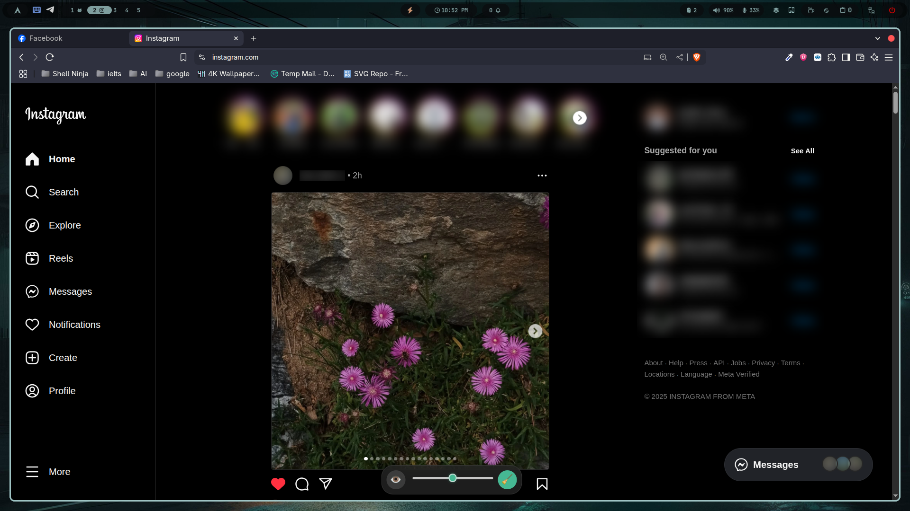

# Blur Sensitive Content Chrome Extension

A simple Chrome extension to blur/hide sensitive content on webpages during screen sharing or recording.

## Installation

### Clone or Download

- **Clone**: Run `git clone https://github.com/kazi331/blur-sensitive-content-from-webpage.git`
- **Download**: Click "Code" > "Download ZIP", then extract it.

### Load in Chrome

1. Open Chrome and go to `chrome://extensions/`.
2. Enable "Developer mode" (top right toggle).
3. Click "Load unpacked" and select the `blur-sensitive-content-from-webpage` folder.
4. The extension icon will appear in the toolbar.

## Usage

- Click the icon to show/hide the toolbar.
- Click the eye icon (`👁️`) to enable/disable blurring (teal when on).
- Hover over elements to highlight, click to blur/unblur.
- Adjust the slider for blur intensity (0–20px).
- Click the broom icon (`🧹`) to clear all blurs.

## Updating

- Pull updates with `git pull` or download a new ZIP and reload.

_Last updated: June 01, 2025_
